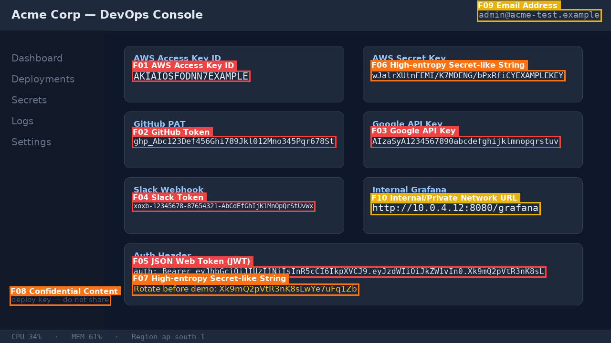
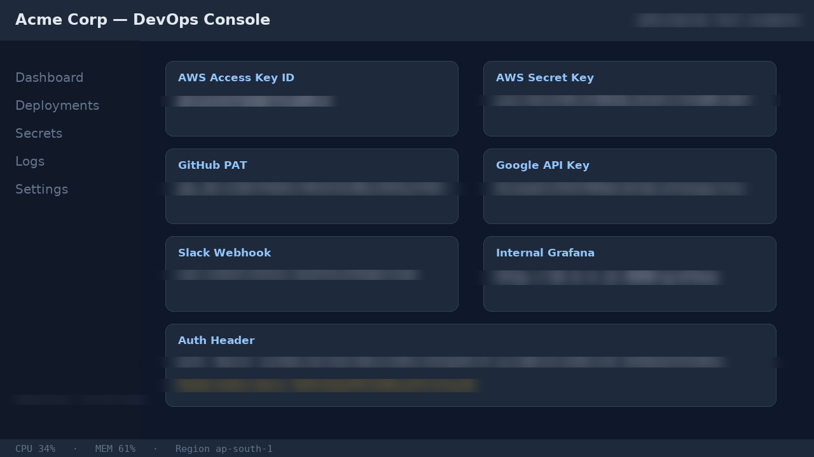

# VeilShare Edge

**On-device privacy firewall for screen sharing and screenshots on Snapdragon-powered HP PCs.**

> Competition target: Snapdragon® AI Lab Build & Present Challenge — Solution Submission Round  
> Runtime principle: process sensitive screen content locally; do not send screenshots, OCR text, or secrets to cloud services.

---

## 1. Problem

Students, developers, teachers, support agents, and professionals routinely share screens during interviews, demos, online classes, client calls, livestreams, and hackathon presentations. One accidental screen share can expose:

- API keys and access tokens
- passwords and recovery codes
- Aadhaar/PAN-like identifiers, student IDs, employee IDs
- emails, phone numbers, addresses
- private dashboards, internal notes, confidential launch plans

Existing solutions are usually manual: blur before sharing, crop screenshots, or hope the presenter notices. Cloud-based DLP is unsuitable for many personal or student workflows because the sensitive screen itself must be uploaded before it can be protected.

---

## 2. Solution

**VeilShare Edge** is a local-first Windows app designed for Snapdragon-powered HP PCs. It scans a selected screen/window or uploaded screenshot, detects sensitive visual text using on-device OCR and a lightweight semantic sensitivity classifier, highlights risk, and creates a redacted **Safe Share** view.

The product behaves like a pre-flight privacy check:

1. Capture or upload a screen image.
2. Run OCR locally.
3. Detect exposed sensitive information with rules + semantic AI.
4. Draw risk boxes and explanations.
5. Generate a redacted version suitable for sharing.
6. Show runtime backend and benchmark evidence.

---

## 3. Repository Structure

```text
VeilShare-Edge/
├── README.md               # this file
├── LICENSE                 # MIT
├── requirements.txt        # core deps (CPU dev mode) + optional extras
├── package.json            # convenience scripts (dev / test / benchmark)
├── backend/
│   └── app/                # FastAPI service + all detection logic
│       ├── main.py         #   API endpoints + local web UI host
│       ├── pipeline.py     #   scan orchestration (OCR → detect → risk)
│       ├── ocr.py          #   EasyOCR / simulated-sidecar / none (labeled)
│       ├── detectors.py    #   regex + Luhn/Verhoeff + entropy detectors
│       ├── semantic.py     #   MiniLM classifier + keyword fallback (labeled)
│       ├── risk.py         #   severity scoring
│       ├── redact.py       #   blur / blackout / pixelate renderer
│       ├── privacy.py      #   psutil connection-diff privacy proof
│       ├── runtime_info.py #   ONNX Runtime / QNN provider telemetry
│       ├── demo_data.py    #   synthetic demo screenshots + sidecars
│       └── checksums.py    #   Luhn + Verhoeff implementations
├── frontend/               # local web UI (vanilla JS, no build step)
├── demo/sample_inputs/     # 4 synthetic demo PNGs (OCR sidecars generated on boot)
├── scripts/
│   ├── generate_demo_inputs.py  # regenerate demo screenshots
│   └── benchmark.py             # latency/memory/provider harness
├── tests/                  # 58 pytest tests (detectors → API end-to-end)
├── docs/                   # architecture, API, demo script, privacy, …
├── models/                 # model strategy (weights never committed)
├── benchmarks/             # recorded performance evidence
├── packaging/              # PyInstaller spec + desktop launcher (Windows .exe)
└── assets/screenshots/     # real pipeline output — risk overlays + Safe Share
```

Documentation index: [Architecture](docs/ARCHITECTURE.md) ·
[API](docs/API.md) · [Demo Script](docs/DEMO_SCRIPT.md) ·
[Privacy Model](docs/PRIVACY.md) ·
[Snapdragon Deployment](docs/SNAPDRAGON_DEPLOYMENT.md) ·
[Packaging (Windows .exe)](docs/PACKAGING.md) ·
[Submission Checklist](docs/SUBMISSION.md)

## Screenshots

Real output from this repository's own detection + redaction pipeline
(`backend/app/pipeline.py`, `backend/app/redact.py`) run against the
synthetic demo inputs in `demo/sample_inputs/` — not mockups.

| Risk overlay (findings + severity) | Safe Share (blur redaction) |
|---|---|
|  |  |

More scans (invoice, student portal, confidential slide) and the two other
redaction modes (blackout, pixelate) are in `assets/screenshots/` — see
`assets/README.md` for the full index.

## Windows executable

A packaged `VeilShareEdge.exe` is built automatically on every push via
GitHub Actions (`.github/workflows/build-windows.yml`) on a genuine Windows
runner — download it from the repo's **Actions** tab, unzip, and run, no
Python install required. See [docs/PACKAGING.md](docs/PACKAGING.md) for
details and for building it yourself.

---

## 4. Key Features

### MVP features

- Local screenshot/screen-region scanning
- OCR-based text localization
- Detection of secrets, tokens, IDs, emails, phone numbers, payment-like patterns, and confidential phrases
- Severity labels: Critical, High, Medium, Low
- One-click redaction: blur, blackout, or pixelate
- Before/after comparison slider
- Privacy proof panel: cloud calls disabled during scan
- Runtime backend panel: QNNExecutionProvider / CPU fallback detection
- Benchmark harness for latency, memory, and execution-provider reporting

### Should-have features

- Live selected-window scanning every N seconds
- Policy presets: developer, student, enterprise, teacher
- Local SQLite metadata-only audit log
- Qualcomm AI Hub profiling evidence folder

### Nice-to-have features

- Virtual camera/window output for real-time redacted screen sharing
- Speech leak detection using local ASR
- Admin-managed DLP policy export/import

---

## 5. Architecture

```text
USER
 ↓
VeilShare Edge UI
 ↓
Local Capture / Upload
 ↓
Image Preprocessing
 ↓
On-device OCR Model
 ↓
Sensitive Data Engine
 ├─ Regex + entropy detectors
 ├─ MiniLM semantic sensitivity classifier
 └─ risk scoring + policy engine
 ↓
Snapdragon AI Acceleration Layer
 ├─ ONNX Runtime QNN Execution Provider on Snapdragon PC
 ├─ Qualcomm AI Hub optimized model assets
 └─ CPUExecutionProvider fallback for development
 ↓
Redaction Renderer
 ↓
Safe Share Result
 ↓
USER ACTION: share, export, or fix exposure
```

---

## 6. AI Model Strategy

### OCR model

- **Model:** EasyOCR from Qualcomm AI Hub Models
- **Role:** Detect and recognize text in screenshots and screen regions
- **Input:** RGB screenshot frame
- **Output:** text regions, recognized strings, confidence scores
- **Why:** OCR is necessary because screen leaks are visual. Regex cannot detect an API key in an image unless text is first extracted.
- **Target deployment:** ONNX Runtime on Windows with QNNExecutionProvider where supported.

### Semantic sensitivity model

- **Model:** MiniLM-v2 from Qualcomm AI Hub Models, or a fine-tuned DistilBERT classifier if time allows
- **Role:** Detect context-sensitive confidential text that does not match fixed patterns, such as “internal roadmap”, “salary sheet”, “do not share”, or “client contract”.
- **Input:** OCR text snippets and surrounding context
- **Output:** embedding or sensitive-category score
- **Why:** Rules catch obvious secrets; semantic AI catches meaning-based leaks.

### Deterministic detectors

- Regex, checksum, and entropy detectors identify structured high-risk strings:
  - API keys, JWTs, tokens, private keys
  - email addresses, phone numbers
  - payment-like numbers using Luhn checks where appropriate
  - Aadhaar/PAN-like sample patterns for demo data

---

## 7. Snapdragon Integration

VeilShare Edge is designed for Snapdragon-powered HP PCs, especially Windows on Snapdragon machines. The intended acceleration path is:

```text
PyTorch / ONNX model
 → Qualcomm AI Hub Workbench compile/profile
 → optimized ONNX or QNN-compatible asset
 → ONNX Runtime + QNNExecutionProvider
 → Qualcomm Hexagon NPU / HTP backend
```

### Important honesty note

This repository includes CPU fallback so development can happen on non-Snapdragon machines. **NPU acceleration must only be claimed after running on an actual Snapdragon-powered Windows PC or after obtaining valid Qualcomm AI Hub profiling output for the selected target.**

---

## 8. On-Device Processing

At runtime, the app is designed so that:

- Screenshots stay on the local machine.
- OCR text stays on the local machine.
- Redacted output is generated locally.
- Raw screenshots are not written to persistent storage by default.
- Optional history stores metadata only, not raw pixels.

Cloud usage is limited to optional development-time model optimization/profiling through Qualcomm AI Hub Workbench.

---

## 9. Installation

### Development mode on macOS/Windows/Linux CPU fallback

```bash
git clone https://github.com/THEMIGHTYBULL/VeilShare-Edge.git
cd VeilShare-Edge
python -m venv .venv
source .venv/bin/activate  # Windows: .venv\Scripts\activate
pip install -r requirements.txt
python backend/app/main.py  # or: python -m uvicorn backend.app.main:app --reload
```

Open **http://127.0.0.1:8000** — the local web UI loads with the four
built-in demo screenshots ready to scan. The server binds to 127.0.0.1 by
default (privacy-first: no LAN exposure).

Run the test suite:

```bash
python -m pytest tests/ -q        # 58 tests
```

Regenerate the synthetic demo inputs (optional — they are committed):

```bash
python scripts/generate_demo_inputs.py --force
```

### Target mode on Snapdragon-powered Windows PC

Install on Windows ARM64 with the appropriate Python version and ONNX Runtime QNN package supported by your environment:

```bash
python -m pip install onnxruntime-qnn
```

Then download or compile the OCR and embedding model assets using Qualcomm AI Hub / AI Hub Models. Exact commands should be confirmed with `qai-hub-models info <model>` because model packaging evolves.

---

## 10. Usage

1. Open VeilShare Edge.
2. Click **Load Demo Screenshot** or **Capture Window**.
3. Click **Scan Locally**.
4. Review risk boxes.
5. Click **Create Safe Share**.
6. Export the redacted image or use it in a presentation.

---

## 11. Demo Instructions

Use only synthetic data during judging.

Recommended demo data:

- Fake student portal with fake student ID and fake email
- Fake developer dashboard with fake API key and fake token
- Fake invoice with fake account number
- Fake confidential slide marked “internal roadmap”

Do not show real secrets or personal identifiers.

---

## 12. Performance Evidence

Do not commit fabricated numbers. Before final submission, run:

```bash
python scripts/benchmark.py --input demo/sample_inputs/fake_dashboard.png --repeat 20
```

Record:

- OCR latency
- total scan latency
- model provider used
- peak memory estimate if available
- whether QNNExecutionProvider loaded
- whether CPU fallback occurred
- network requests during scan

Store outputs in:

```text
benchmarks/
├── linux_cpu_dev_run.json         # recorded: CPU container, simulated-sidecar OCR
├── mac_cpu_dev_run.json           # placeholder until run
├── snapdragon_qnn_run.json        # placeholder until run on real hardware
└── qualcomm_ai_hub_profile_links.md
```

The recorded dev run (`linux_cpu_dev_run.json`) measures detector + pipeline
overhead with the simulated-sidecar OCR engine — real EasyOCR latency must
be measured on the target machine. See `benchmarks/README.md` for the
protocol.

---

## 13. Privacy

VeilShare Edge is built for privacy-sensitive workflows:

- No runtime cloud OCR
- No remote image upload
- Raw images not persisted by default
- Local-only redaction
- Sanitized logs
- Optional air-gapped mode

---

## 14. Technical Stack

- Frontend: React + TypeScript, or a simple local web UI for MVP
- Backend: Python FastAPI
- OCR: EasyOCR / Qualcomm AI Hub optimized asset
- Semantic model: MiniLM-v2 embeddings or DistilBERT classifier
- Inference: ONNX Runtime; QNNExecutionProvider on Snapdragon target; CPU fallback for development
- Redaction: OpenCV/Pillow
- Benchmarking: Python time/perf counters, psutil, ONNX Runtime provider inspection
- Packaging: local web app or Windows desktop wrapper after MVP

---

## 15. Future Roadmap

1. Snapdragon-validated QNN inference path
2. Live selected-window scanning
3. Virtual safe-share output window
4. Local ASR for spoken-secret detection
5. Fine-tuned sensitivity classifier
6. Enterprise policy packs
7. Accessibility mode for low-vision presenters

---

## 16. Screenshots / Placeholders

```text
assets/screenshots/dashboard.png       # Main scan screen
assets/screenshots/risk_overlay.png    # Bounding boxes and severity labels
assets/screenshots/safe_share.png      # Redacted output
assets/screenshots/snapdragon_panel.png# Runtime/backend telemetry
```

---

## 17. Known Limitations

- NPU acceleration requires an actual Snapdragon-powered Windows PC and compatible runtime.
- OCR may miss very small, distorted, low-contrast, or rapidly changing text.
- Regex and semantic classifiers can produce false positives and false negatives.
- The MVP protects screenshots and selected windows; full OS-level DLP is out of scope.
- This tool reduces accidental disclosure risk; it is not a replacement for enterprise security policy.

---

## 18. Credits

- Qualcomm AI Hub Models and Workbench for model optimization/deployment workflows
- ONNX Runtime QNN Execution Provider for Snapdragon hardware-accelerated ONNX inference
- EasyOCR open-source project
- Sentence Transformers / MiniLM-v2 research and implementation

---

## 19. License

MIT License. See `LICENSE`.
